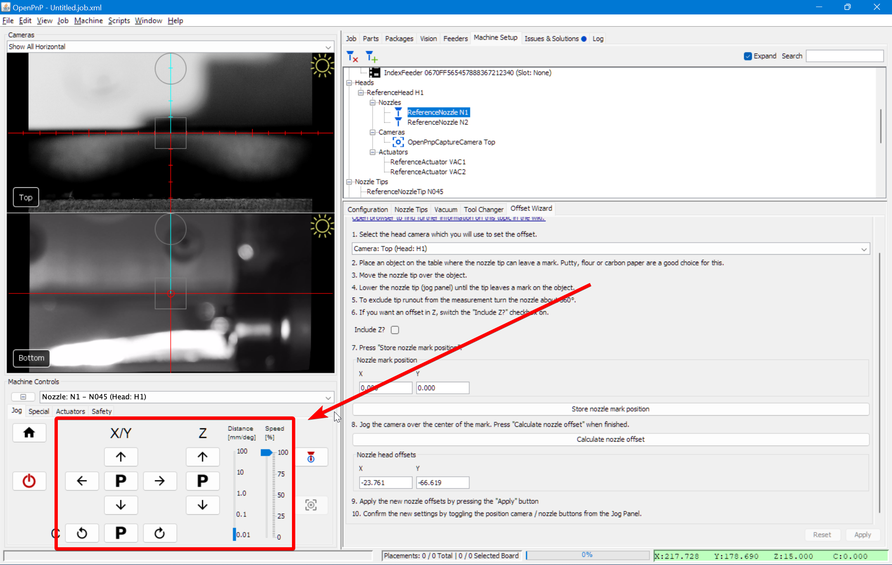
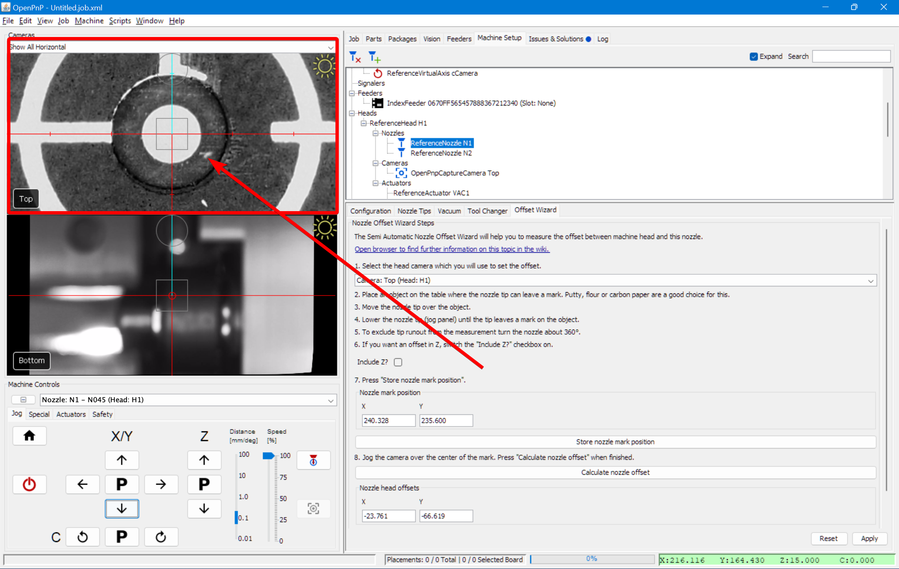
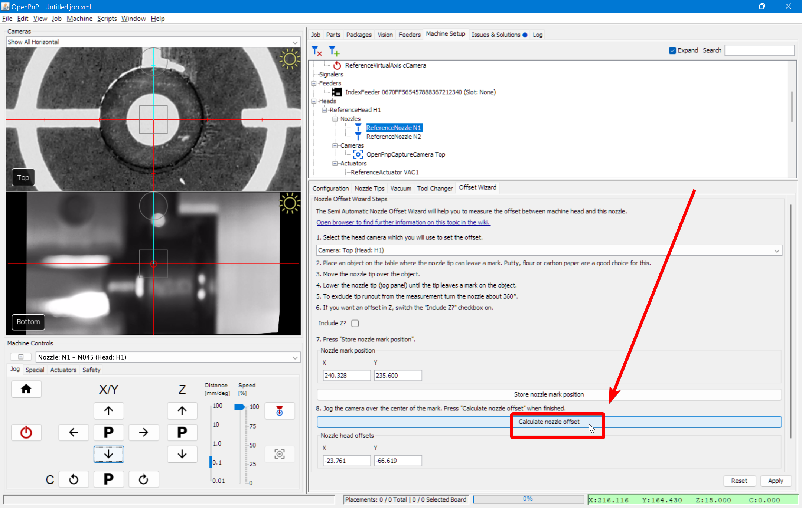

# Nozzle Offset ([Video Guide](https://youtu.be/h3mtEQfGMlM?si=wUI5YeJmyOG8ii4G&t=1375))

Now we need to tell OpenPnP how far the nozzles are away from the center point of the top camera. There are multiple strategies you can use to calculate this. One way is to use OpenPnP's built in Offset Wizard. You can read the OpenPnP docs about this step [here](https://github.com/openpnp/openpnp/wiki/Setup-and-Calibration_Nozzle-Setup).

!!! info "Tip"
    OpenPnP has some new methods of calibration using a secondary fiducial at a different Z height, and a small piece of paper. If you'd like to explore this method of calibration, you can find the OpenPnP docs about this process [here](https://github.com/openpnp/openpnp/wiki/Calibration-Solutions#calibrating-precision-camera-to-nozzle-offsets). This process requires [making and installing a calibration rig](https://github.com/openpnp/openpnp/wiki/Vision-Solutions#calibration-rig), [3D Units per Pixel calibration](https://github.com/openpnp/openpnp/wiki/3D-Units-per-Pixel), and [Advanced Camera Calibration](https://github.com/openpnp/openpnp/wiki/Advanced-Camera-Calibration).

1. Ensure you still have an N045 nozzle on the left toolhead.
  
    

1. Click on the `Machine Setup` tab in the top right pane.
  
    

1. Click on the "Expand" checkbox to open all of the features about your machine.
  
    

1. Click on `Heads > ReferenceHead H1 > Nozzles > ReferenceNozzle N1`
  
    

1. Click on the `Offset Wizard` tab.
  
    
  
1. Confirm that the `Include Z?` checkbox is unchecked.
  
    

2. Select the `Nozzle: N1` from the machine controls dropdown.
  
    

3. Jog the nozzle so that it is just barely touching the datum board, and perfectly centered over the homing fiducial. We recommend looking for the shiny edge of the gold fiducial poking out from under the nozzle tip to determine if you've centered it correctly.
  
    
  
    
  
    

4.  Click `Store nozzle mark position`. Do not navigate away from this configuration page while running the wizard.
  
    

5.  Raise the nozzle off the datum board.
  
    

6.  Jog the X and Y axes to bring the top camera directly centered over the homing fiducial. Do not switch away from the Offset Wizard tab, as OpenPnP will not save your nozzle mark position.
  
    

7.  After centering the homing fiducial in the top camera view, click `Calculate nozzle offset`.
  
    

8.  Click `Apply` to save the nozzle offset change.
  
    

9.  Start again from step 1 to calibrate your right nozzle. Use the `Heads > ReferenceHead H1 > Nozzles > ReferenceNozzle N2` section.

!!! info "Further Adjustment"
    If you find that your placement accuracy is slightly incorrect after performing this calibration, you can fine-tune your part placement by adjusting the X and Y offsets in the relevant nozzle settings, as shown below.
    

## Next Steps

Next is [Bottom Camera Position](../7-bottom-camera-position/index.md).
