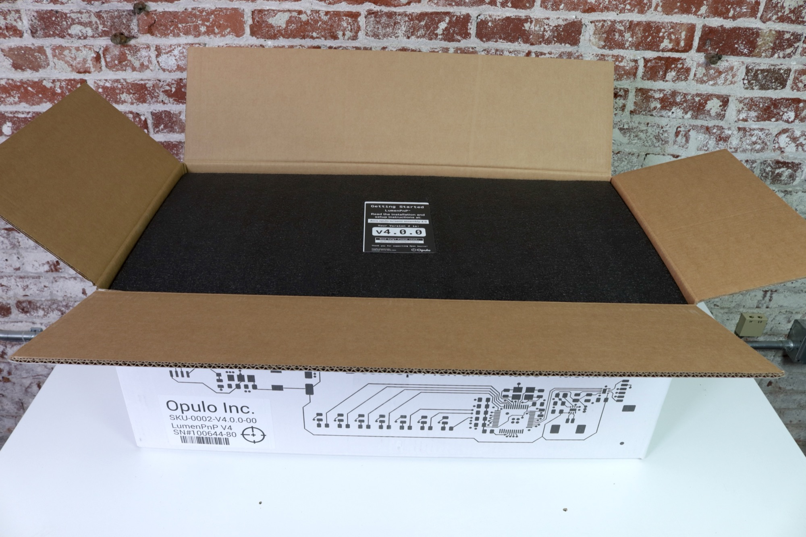
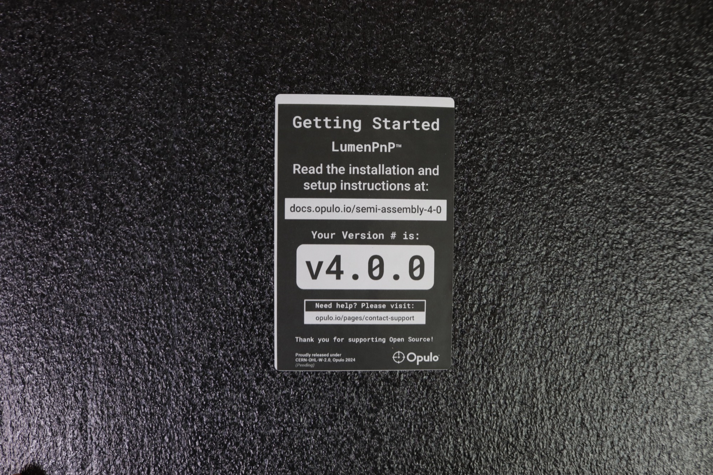
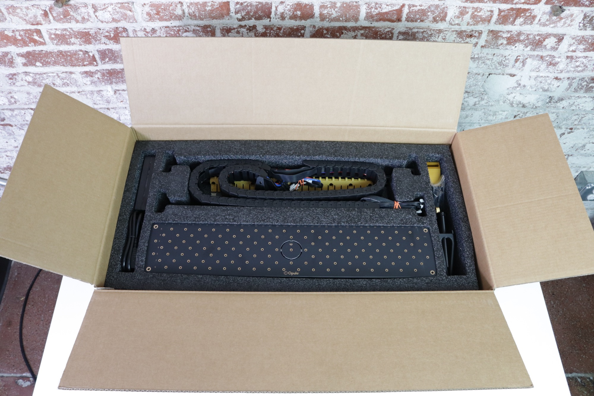
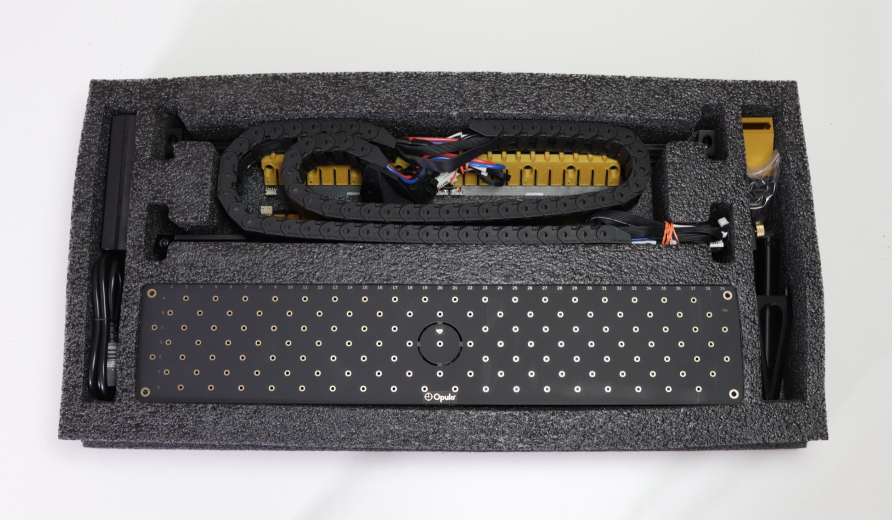
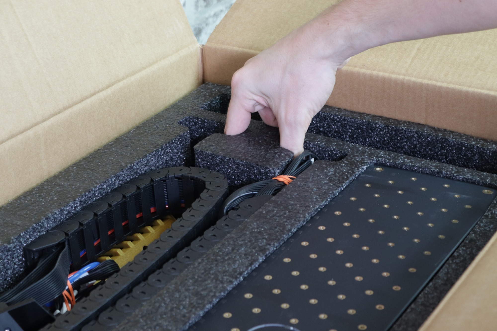
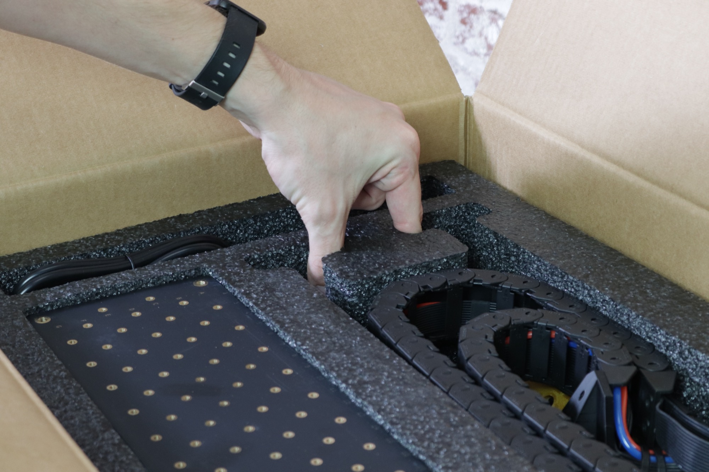
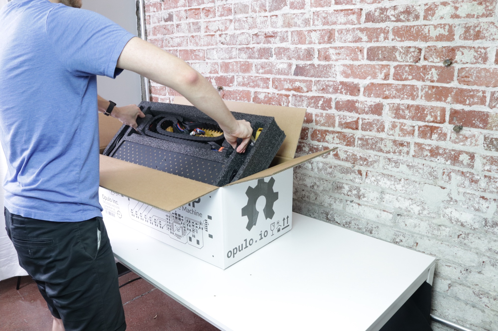
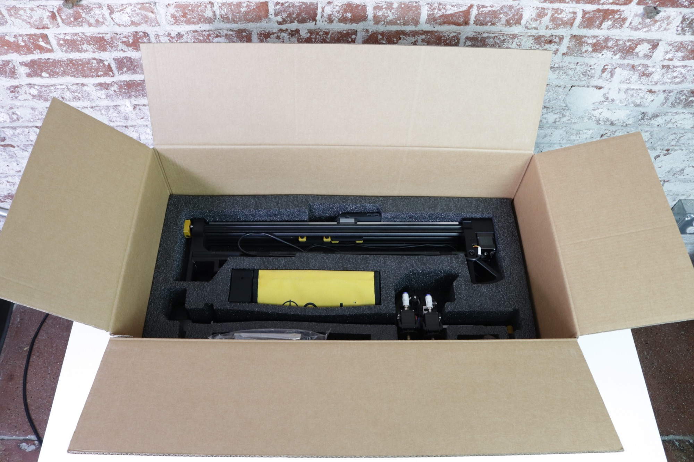
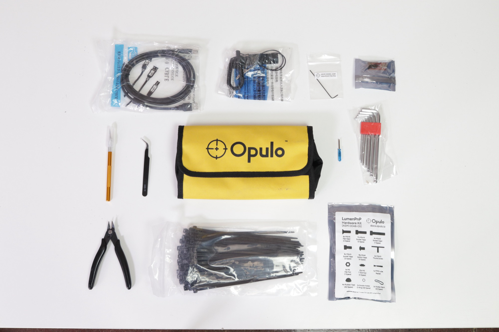

# Unboxing

1. Open the LumenPnP box and look for the `Getting Started` card attached to the top sheet of foam. This has your machine's version number.

    
    

    !!!warning "Make sure your version number begins with `v4`."

    

2. Remove the top protective layer of foam and reveal the first tray of components.

    

3. This tray contains:
    * Staging plate
    * Build plate
    * Feet for the build and staging plates
    * Cable chain assembly
    * Y Limit Switch Striker
    * IEC power cable and power supply
    * Front rail w/25 feeder slots installed
    * Back rail w/25 feeder slots installed
    * 10x Extrusion cable clips
    * Alignment bracket
    * Control Box

     

4. Grab the foam as shown below, rotate the tray up, then pull it out and set it aside, revealing the second tray of parts.

    
    
    
    
    

5. The second tray contains the following parts:
    * Left and right Y gantry assemblies
    * X gantry assembly
    * Getting started kit
    * Tool bag
    * Leg extensions
    * Feeder Blade Cable Harnesses
    * Nozzle Rack

    

1. Inside the tool bag you'll find the following items:
    * Hobby knife
    * Flush snips
    * 135 degree tweezers
    * Allen wrench set w/separate 1.3mm driver for adjusting feeder drive wheels
    * Small Phillips screwdriver
    * ESD wrist strap
    * USB-A to USB-B cable
    * Hardware Kit
    * Zip ties
    * Feeder programmer
  
    

## Next Steps

Next, you'll [assemble the frame](../frame/index.md).
